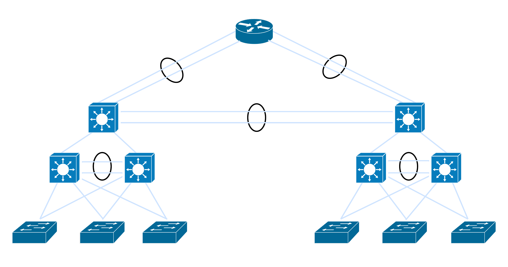
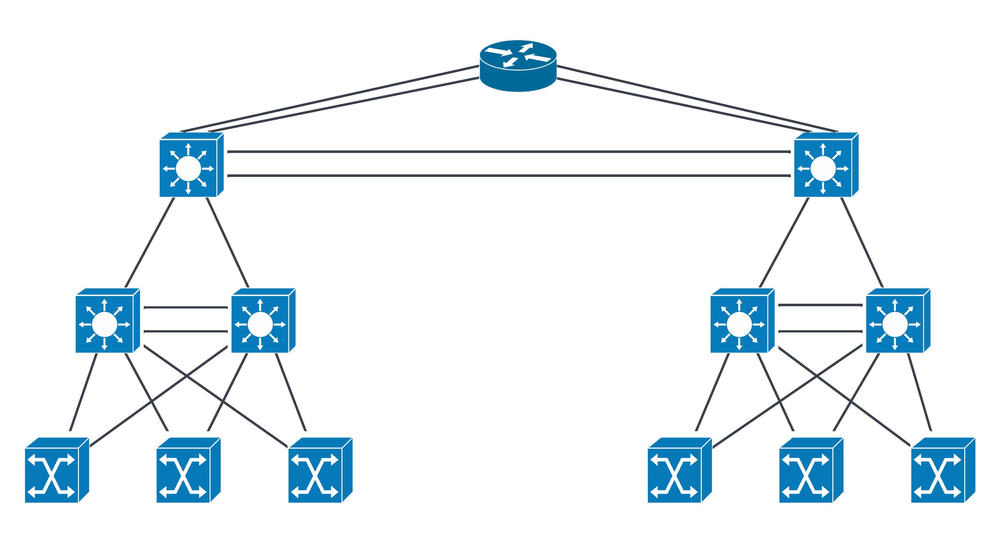

# Two-Campus-Three-Tier-Design

This project implements a topology for an enterprise network based on the three-tier LAN campus design (core, distribution and access).

It is developed on GNS3, simulating real networks design and scalability.

**Topology**

<<<<<<< HEAD

=======

**Main Characteristics**

- Inter-VLAN routing
- OSPF Routing protocol
- Redundancy with HSRP and Etherchannel
- NAT Implementation
- Security (ACLs, Port-Security, Dynamic ARP Inspection, DHCP Snooping)

**Tecnologies**

- Cisco IOU L2/L3
- GNS3
- Git and Github

**Author** 

Gustavo Martinez
>>>>>>> refs/remotes/origin/main
