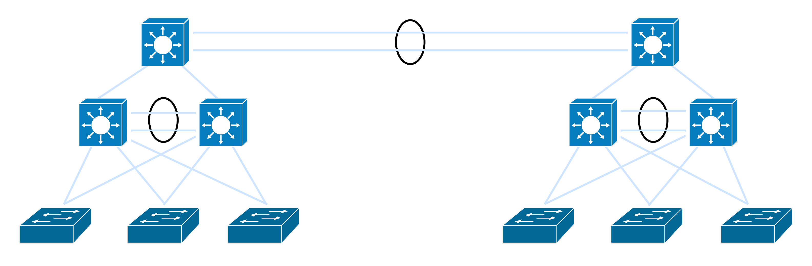

# Two-Campus-Three-Tier-Design

This project implements a topology for an enterprise network based on the three-tier LAN campus design (core, distribution and access).

It is developed on GNS3, simulating real networks design and scalability.

**First Stage Topology**

**Main Characteristics**

- Inter-VLAN routing
- OSPF Routing protocol
- Redundancy with HSRP and Etherchannel
- Security (ACLs, Port-Security, Dynamic ARP Inspection, DHCP Snooping)
- DHCP Implementation

 **Final Stage Topology** 

 
 

 **Main Characteristics**
 
- External Connections with Floating Static Routes

**Documentation**

[IPv4 Addressing Table](docs/ip_addressing)
[VLAN and Subnet Plan](docs/vlan-and-subnet-plan)

**Technologies**

- Cisco IOU L2/L3
- GNS3
- Git and Github
- Python
- Netmiko
- Ubuntu Server

**Author** 

Gustavo Martinez

